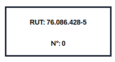
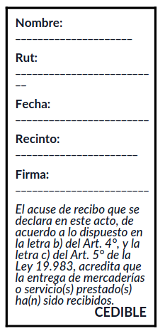

# Documentación de migración y consideraciones de Odoo 18

## Configuraciones iniciales
Una de las ventajas de trabajar en Odoo es que _casi todo es automático_, mientras se configure de forma apropiada.

### Empresa
Para configurar la empresa, vas a **Ajustes > Usuario y empresas** y elige la empresa.
Rellena los campos.

### Clientes
Ve a **Contactos**.

### Formato de números
Por defecto, todos los números se muestran con dos decimales. Para cambiar esto, ve a **Ajustes** y activa el **Modo de desarrollador** que se encuentra al fondo de la página.
Luego, vas al submenú **Técnico > Precisión decimal**.

### Métodos de pago
Recordar agregar más metodos de pago en **Ajustes > Punto de Venta > Pago > Métodos de pago**, ya que viene solamente el pago con tarjeta de forma predeterminada.

### Activación del modo quiosco
Para activar el modo quiosco, ve a **Ajustes > Punto de venta**, activar la opción _Es un bar/restaurante_ y guardar los cambios. Tras esto deberia aparecer el submenú de _Autopedidos por celular y quioscos_.
Si la empresa no es un bar/restaurate, se puede desactivar esa opción y guardar los cambios y la opcóon de autopedidos quedara ahí. 

_// Nota de editor: no sé por que pasa todo esto es muy engorroso._

## Migración de productos
**_// En proceso_**
Entra a **Inventario > Productos**. Si se tiene la vista de los productos en modo Kanban (en cuadros), cámbiala a lista.
En el engranaje, debe de aparecer la opción "exportar todo". Esto descargará un archivo .xlsx con todos los productos.
Luego, en la otra base de datos, ve a **Punto de Venta > Productos**[^1] y en el engranaje selecciona "Importar registros". Ahí puedes subir un archivo de datos tipo .xlsx (Excel) o .csv.

[^1]: Para que todos los productos importados se muestren en cualquier punto de venta, es mejor importar los productos tomando ese camino y no por cualquier otro (e.j.: Inventario > Productos). Si se hace de otra manera, el producto importado no tendrá activado la opción "Punto de Venta", el cual hace visible el producto en dicho módulo. Claro, esto se puede cambiar accediento al producto y activando tal opción, pero es engorroso cuando hablamos de cientos de productos.

## Cómo se usa / Cómo se hace
### Gastos
Para realizar un reembolso, puedes subir una foto de la boleta. También se puede rellenar de forma manual, pero sale más rápido con la foto de la boleta.

### Facturas de venta
Primero se debe de realizar un pedido de venta antes de realizar alguna factura. Esto se puede hacer en **Ventas**. Tras hacer el pedido, aparecerá el botón de creación de facturas.

### Facturas de compra
Para realizar una factura de compra, se debe de realizar una solicitud de compra y confirmar la entrega de los productos. Ve a **Compra** y realiza una compra. Antes de realizar la factura, primero debes de confirmar el recibimiento de los productos pedidos.
Si ya confirmaste el inventario recibido, puedes volver al menú de solicitudes de presupuesto y seleccionar el pedido el cual se quiere realizar la factura.

### Variantes de producto
Ve a **Ajustes > Inventario** y activa la opción "Variantes"

## Particularidades
### Formato de PDF en facturas
A pesar de que debería ser automático, puede ser que ocurra un error (desconocido hasta el momento) y no sé cambie el formato del PDF de la factura al formato que pide el SII.
Para esto, hay que **abrir Studio** e ingresar a cualquier aplicación. Luego, ir a **Reportes**, sacar el filtro automático y seleccionar _PDF_, el cual es el que se utiliza para mostrar una factura.
Vas a **EDITAR FUENTES**, luego ve a _report_invoice (l10n_cl.report_invoice)_ y copia y pega el siguiente código.
```html
<data inherit_id="account.report_invoice">
        <!-- xpath expr="//t[@t-call='account.report_invoice_document']" position="after"-->
            <!--t t-if="o._get_name_invoice_report() == 'l10n_cl.report_invoice_document'" t-call="l10n_cl.report_invoice_document" t-lang="lang"/-->
        <!--/xpath-->
</data>
```
Luego, ve a _report_invoice (account.report_invoice)_ y copia y pega lo siguente:
```html
<t t-name="account.report_invoice">
            <t t-call="web.html_container">
                <t t-foreach="docs" t-as="o">
                    <t t-set="lang" t-value="o.partner_id.lang"/>
                    <t t-call="l10n_cl.report_invoice_document" t-lang="lang"/>
                </t>
            </t>
        </t>
```

Si todo esta correcto, deberá mostrarse el formato correcto en la factura.

### Cuadro de información de la boleta
Hay veces que en el cuadro superior derecha no aparezca el tipo de factura, así como sale en la imagen.

Primero, asegúrate de que agregaste el tipo de factura a la hora de realizarla, ya que ese puede ser tú error, pero si lo hiciste e igual no aparece el tipo de factura, entonces realiza lo siguiente:
Activa el Modo de Desarrollador escribiendo `?debug=1` al final del link. Luego, ve a **Ajustes > Técnico > Vistas**, busca "_custom_header_" y entra el que tiene ID Externo _l10n_cl.custom_header_. Luego, edita la línea 6 tal que quede así
```html
		...
        <t t-set="report_name" t-value="o.l10n_cl_reference_ids.l10n_cl_reference_doc_type_id.name"/>
		...
```
Tras esto, debería estar todo listo. Realiza una factura para asegurarse.

### Cuadro de factura cedible
Sigue los mismos pasos para acceder al PDF de la factura y editar su fuente. En "_report\_invoice\_document (l10n\_cl.report\_invoice\_document)_", copia y pega lo siguiente antes de la última línea:
```html
        <xpath expr="//div[@id='right-elements']" position="after">
            <div>
              <div t-if="o.l10n_cl_reference_ids.l10n_cl_reference_doc_type_id.code == '34'" style="line-height:15px">
                  <div style="border: 3px solid black; padding: 10px; width: 200px; height:auto; ">
                  <div>
                      <p><strong>Nombre:</strong> _____________________</p>
                      <p><strong>Rut:</strong> __________________________</p>
                      <p><strong>Fecha:</strong> ________________________</p>
                      <p><strong>Recinto:</strong> ______________________</p>
                      <p><strong>Firma:</strong> ________________________</p>
                  </div>
                  <div style="">
                      <p><i>El acuse de recibo que se declara en este acto, de acuerdo a lo dispuesto en la letra b) del Art. 4°, y la letra c) del Art. 5° de la Ley 19.983, acredita que la entrega de mercaderías o servicio(s) prestado(s) ha(n) sido recibidos.</i></p>
                  </div>
                  <div style="text-align:right; font-size:105%; margin-top:-15px">
                      <strong>CEDIBLE</strong>
                  </div>
              </div>
                          </div>
              <div t-else="">
              </div>
            </div>
        </xpath>
```

